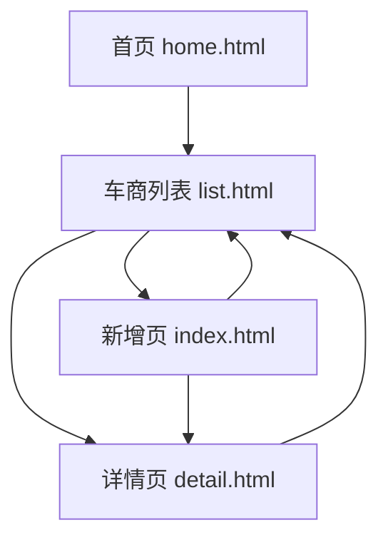

# 二手个人车商入网需求文档

## 1. 需求背景

为支持二手个人车商准入管理，需要提供车商列表查询、新增入网、详情查看能力。业务人员可在列表中快速检索车商，新增二手个人车商入网资料，提交证明材料，并在详情页查看基础资料、收款账号、证明材料和审批日志。

本需求对应原型页面：

- 车商列表页：`list.html`
- 二手个人车商新增页：`index.html`
- 二手个人车商详情页：`detail.html`

## 2. 功能范围

本期覆盖以下能力：

- 车商列表展示、模糊搜索、筛选入口、新增入口。
- 二手个人车商资料录入。
- 展业城市选择，支持“我的展业城市”与全国城市合并展示。
- 主流销售品牌选择，支持搜索和多选。
- 证明材料上传，支持每类材料多附件上传。
- 跨区域展业城市校验，要求上传跨区域入网特批材料。
- 详情页查看车商基础信息、收款账号、证明材料、审批日志。

## 3. 页面一：车商列表页

页面文件：`list.html`

### 3.1 页面目标

用于展示车商数据，支持业务人员快速搜索目标车商，并进入详情页或新增二手个人车商。

### 3.2 页面元素

- 顶部状态栏。
- 搜索区：
  - 返回按钮。
  - 搜索输入框，占位文案：请输入车商名称/姓名。
  - 清空按钮。
  - 搜索按钮。
- 筛选区：
  - 全部渠道。
  - 全部状态。
  - 全部评级。
  - 更多筛选图标。
- 车商列表卡片：
  - 车商名称或个人姓名。
  - 状态。
  - 标签，例如二手个人、中重卡、轻卡。
  - 渠道商。
  - 负责人。
  - 展业城市。
- 右下角悬浮新增按钮。
- Toast 提示。

### 3.3 列表数据展示规则

- 二手个人车商卡片展示“二手个人”标签。
- 非二手个人车商展示车商级别和业务标签。
- 卡片信息保持高密度展示，便于列表快速扫描。

### 3.4 交互规则

- 点击返回按钮：跳转首页 `home.html`。
- 输入关键字后点击搜索：按车商名称、电话、渠道、城市进行模糊匹配。
- 在搜索框按 Enter：执行搜索。
- 点击清空按钮：清空关键字并恢复列表。
- 点击筛选按钮：当前原型用 Toast 模拟打开筛选。
- 点击更多筛选：当前原型用 Toast 模拟打开高级筛选。
- 点击二手个人车商卡片：跳转详情页 `detail.html`。
- 点击非二手个人车商卡片：当前原型用 Toast 模拟原一级/二级车商详情。
- 点击右下角新增按钮：跳转新增页 `index.html`。

## 4. 页面二：二手个人车商新增页

页面文件：`index.html`

### 4.1 页面目标

用于录入二手个人车商入网资料，并完成证明材料上传和提交校验。

### 4.2 页面结构

- 顶部状态栏。
- 标题栏：
  - 返回按钮。
  - 页面标题：二手个人车商入网。
- 表单内容区。
- 底部操作栏：
  - 暂存。
  - 提交。
- 展业城市选择弹窗。
- 主流销售品牌选择页。
- Toast 提示。

### 4.3 表单字段

#### 4.3.1 车商级别

- 一级。
- 二级。
- 个体。

默认选中：个体。

当选择“个体”时，页面按二手个人车商模式展示。

当选择一级/二级时：

- 展示传统车商字段。
- 展示入网步骤页签。
- 隐藏二手个人专属说明。

#### 4.3.2 工作信息

二手个人模式下包含：

- 姓名，必填。
- 联系方式，必填。
- 是否中介，必填。
- 业务产品，必填，支持多选：
  - 中重卡。
  - 轻卡。
- 业务类型：二手车。
- 展业城市，必填。
- 车商评级，必填：
  - 核心车商。
  - 普通车商。
- 主流销售品牌，必填。

### 4.4 展业城市选择

入口：点击“展业城市”字段。

弹窗展示：

- 顶部操作：
  - 取消。
  - 标题：展业城市。
  - 确定。
- 已选择展业城市。
- 城市选择区。
- 底部操作：
  - 清空。
  - 确认选择。

规则：

- “我的展业城市”和“全国展业城市”合并为一个页签体系。
- “我的展业城市”作为省级分组展示在第一位。
- 默认选中“我的展业城市”。
- 已选择城市以标签展示。
- 再次点击已选城市可取消选择。
- 选择非本人展业范围城市时，Toast 提示：该城市不在你的展业范围内，提交前需上传特批材料。
- 选择非本人展业范围城市后，页面展示提示：已选择非本人展业范围城市，请在证明材料中上传“跨区域入网特批材料”。
- 同时显示“跨区域入网特批材料”上传项。

### 4.5 主流销售品牌选择

入口：点击“主流销售品牌”字段。

页面展示：

- 返回按钮。
- 标题：选择销售品牌。
- 完成按钮。
- 搜索框。
- 已选择品牌。
- 品牌列表。
- 底部操作：
  - 清空。
  - 确认选择。

规则：

- 支持品牌搜索。
- 支持多选。
- 已选品牌以标签展示。
- 再次点击已选品牌可取消选择。
- 点击完成或确认选择后，将品牌回填到新增页。

### 4.6 门店基本信息

字段包括：

- 是否有展厅。
- 经营类型。
- 门店地址。

### 4.7 联系人信息

一级/二级车商模式下展示联系人信息模块。

字段包括：

- 业务联系人。
- 联系人手机号。

二手个人模式下，该模块隐藏。

### 4.8 收款账号

字段包括：

- 账户类型。
- 开户名称。
- 收款账号。
- 开户行。

规则：

- 二手个人模式下，账户类型默认为个人。
- 姓名变化时，开户名称自动同步为姓名。

### 4.9 证明材料

材料项包括：

- 身份证，必填。
- 打卡照，必填。
- 收款证明，必填。
- 银行卡正面，必填。
- 佐证从业经验资料，必填。
- 跨区域入网特批材料，条件必填。
- 合作商合作协议，非必填。
- 二手个人征信报告，非必填。
- 其他材料，非必填。

上传规则：

- 每个材料项支持上传多个附件。
- 每个材料初始至少保留一个上传入口。
- 上传后，当前入口变为已上传附件。
- 已上传附件右上角展示删除按钮。
- 删除附件后，如果该材料没有上传入口，则自动补充一个上传入口。
- 每行最多展示三个附件，超过自动换行。
- 跨区域入网特批材料只有选择跨区域城市后展示。

### 4.10 特殊说明

字段：特殊说明。

用于补充展业范围、从业经验、客户资源等信息。

### 4.11 底部操作

#### 暂存

点击后 Toast 提示：已暂存当前入网信息。

#### 提交

点击提交时执行校验：

- 二手个人模式下姓名不能为空，否则提示：请填写姓名。
- 二手个人模式下联系方式不能为空，否则提示：请填写联系方式。
- 展业城市不能为空，否则提示：请选择展业城市。
- 主流销售品牌不能为空，否则提示：请选择主流销售品牌。
- 如果选择了跨区域城市但未上传跨区域入网特批材料，提示：跨区域城市需上传特批材料。
- 校验通过后提示：校验通过，可提交二手个人车商入网。
- 提交成功后跳转详情页 `detail.html`。

### 4.12 返回交互

点击新增页返回按钮：跳转列表页 `list.html`。

## 5. 页面三：二手个人车商详情页

页面文件：`detail.html`

### 5.1 页面目标

用于查看二手个人车商入网后的完整资料、证明材料和审批日志。

### 5.2 页面结构

- 顶部状态栏。
- 标题栏：
  - 返回按钮。
  - 页面标题：二手个人车商详情。
  - 更多按钮。
- 摘要信息区。
- 详情分组页签。
- 基础信息。
- 收款账号。
- 审批日志底部弹窗。

### 5.3 摘要信息区

展示：

- 姓名。
- 审批日志按钮。
- 手机号。
- 标签：
  - 二手个人。
  - 中重卡。
  - 轻卡。
- 快速信息：
  - 姓名。
  - 联系方式。
  - 所属渠道商。
  - 展业城市。

### 5.4 详情页签

页签包括：

- 基础信息。
- 收款账号。

规则：

- 默认展示基础信息。
- 点击页签切换对应内容。

### 5.5 基础信息

展示字段：

- 车商级别。
- 姓名。
- 联系方式。
- 是否中介。
- 所属渠道商。
- 业务产品。
- 业务类型。
- 车商评级。
- 展业城市。
- 跨区域说明。
- 主流销售品牌。
- 特殊说明。

### 5.6 证明材料展示

详情页展示材料清单和附件状态。

材料包括：

- 身份证：
  - 正面。
  - 反面。
- 打卡照：
  - 门店打卡照。
- 收款证明：
  - 附件1。
  - 附件2。
- 银行卡正面：
  - 附件1。
- 佐证从业经验资料：
  - 附件1。
  - 附件2。
  - 附件3。
- 跨区域入网特批材料：
  - 广州特批。
- 合作商合作协议：
  - 附件1。
- 二手个人征信报告：
  - 未上传。
- 其他材料：
  - 未上传。

### 5.7 收款账号

展示字段：

- 账户类型。
- 开户名称。
- 收款账号。
- 开户行。

### 5.8 审批日志

入口：点击“审批日志”按钮。

弹窗展示：

- 顶部：
  - 取消。
  - 标题：审批日志。
- 时间线：
  - 入网审批通过。
  - 跨区域特批通过。
  - 提交入网资料。

交互规则：

- 点击审批日志按钮：打开底部审批日志弹窗。
- 点击取消：关闭弹窗。
- 点击遮罩：关闭弹窗。

### 5.9 返回交互

点击详情页返回按钮：跳转列表页 `list.html`。

## 6. 页面跳转关系

## 7. 关键状态与校验

### 7.1 车商级别状态

- 个体：展示二手个人字段，隐藏工商/联系人相关字段。
- 一级/二级：展示传统车商字段和入网步骤页签。

### 7.2 跨区域状态

触发条件：

- 已选择城市中存在不属于“我的展业城市”的城市。

触发后：

- 展示跨区域提示。
- 展示跨区域入网特批材料。
- 提交时要求已上传该材料。

### 7.3 上传状态

- 未上传：展示上传入口。
- 已上传：展示附件卡片和删除按钮。
- 删除后：如果当前材料没有上传入口，自动补一个上传入口。

### 7.4 提交校验

提交前必须校验：

- 姓名。
- 联系方式。
- 展业城市。
- 主流销售品牌。
- 跨区域特批材料。

## 8. 非本期范围

当前原型中以下能力为模拟，不作为本期真实后端能力：

- 真实文件上传。
- 真实审批流。
- 真实筛选弹窗。
- 真实车商详情数据接口。
- 真实暂存接口。
- 真实提交接口。

## 9. 数据口径建议

后续接入接口时建议拆分：

- 车商基础信息。
- 业务信息。
- 展业城市。
- 销售品牌。
- 收款账号。
- 证明材料。
- 审批日志。
- 提交校验结果。

